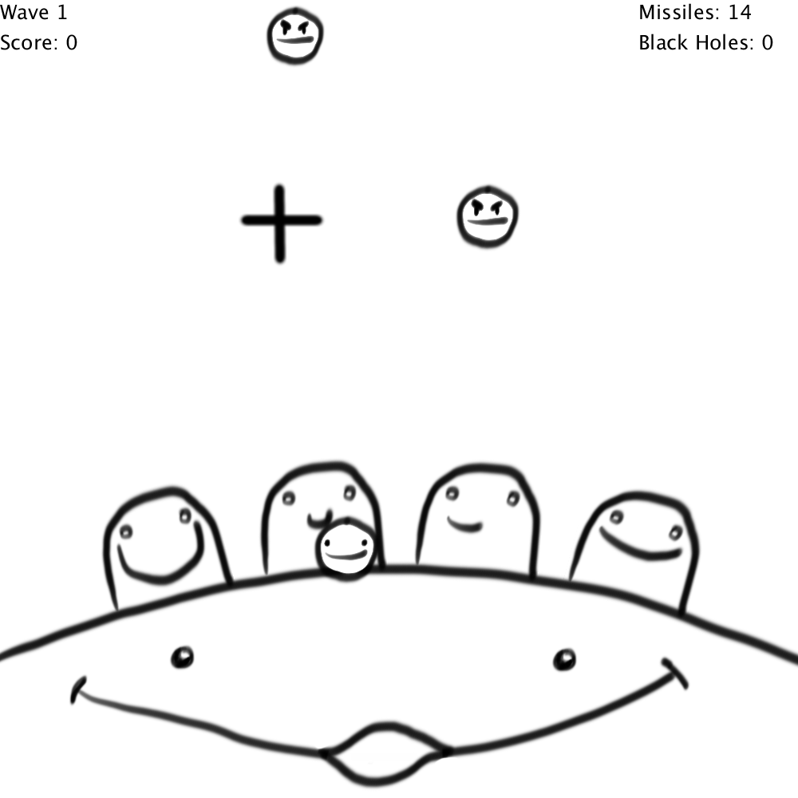

# Particle Command 



## About
Like Missile Command but with physics. Made with Processing.

Defend your "cities" from the particles falling from the top of the screen
by shooting "missiles" with left click to push them away in a series of 
increasingly difficult waves. You only have a limited number of missiles 
that you can fire each wave.  If a city is hit by a particle then it is 
destroyed. If all four cities are destroyed then you lose. At the end of 
the wave you will get score for each unused missile, your missile count 
will be reset, you will gain extra missiles for each surviving city and
one city will be restored. If you complete a wave without losing a city 
then you will be granted a special one use black hole power up that can 
be fired with right click.

## Building and Running
The game can be compiled and run with:

```
ant
```

## Documentation
Doxygen documentation can be generated with:

```
ant -lib lib doxygen
```

The resulting documentation can be found in the `docs` directory.
